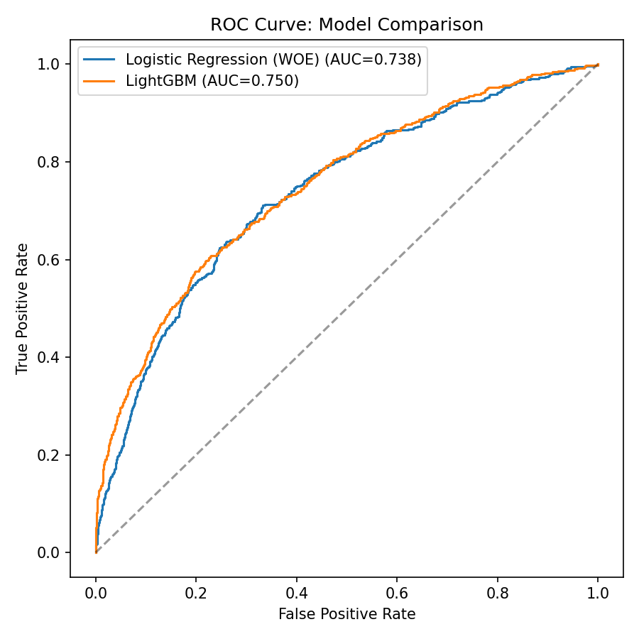
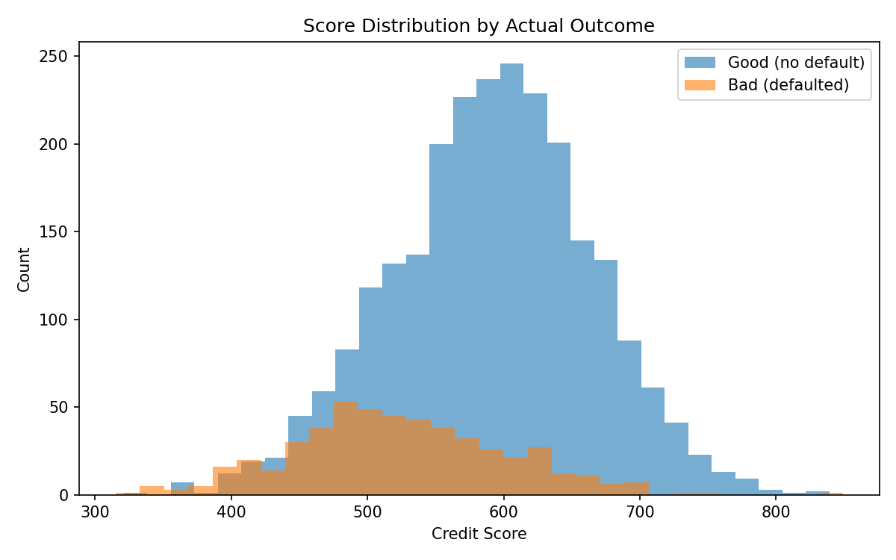
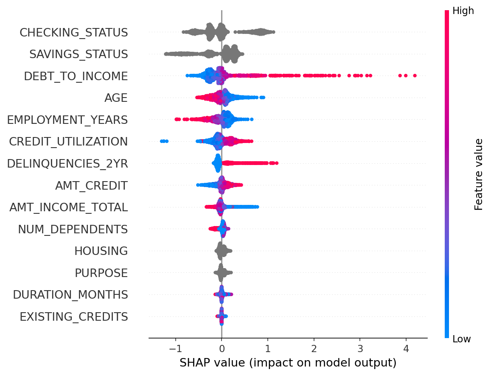
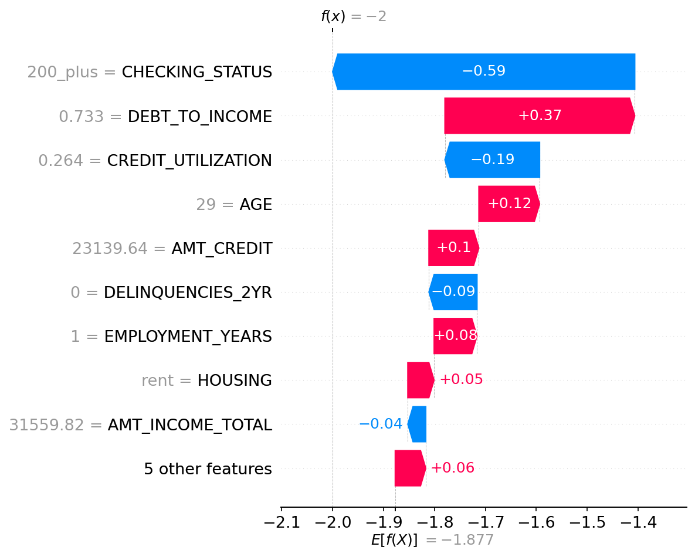

# 💳 Credit Risk Scoring Model

An end-to-end credit risk scoring system: from raw application data to a
regulator-friendly, interpretable **300–850 credit score**, with an
interactive demo app.

This project is built the way credit risk teams actually build scorecards in
production — not just "fit a classifier and report accuracy."

**[▶ Try the live demo](#)** &nbsp;|&nbsp; **[📓 Notebooks](notebooks/)** &nbsp;|&nbsp; **[🧠 Source](src/)**

---

## Why this project is framed the way it is

In credit scoring, the cost of a **false negative** (approving an applicant
who defaults) is not symmetric with a **false positive** (rejecting a good
applicant). A false negative costs the full loan principal; a false positive
costs only the foregone interest margin. This model is evaluated with that
asymmetry in mind — not with plain accuracy, which is close to meaningless
on an imbalanced target like this one.

It's also built to be **explainable by design**: US lenders are required
under ECOA/Regulation B to give applicants specific, factual reasons for
credit denial ("adverse action notices"). A black-box score with no
attribution is not deployable in this industry, no matter how accurate it
is — which is why both an interpretable baseline (WOE + Logistic
Regression) and SHAP attributions for the stronger model are included.

## Dataset

A synthetic applicant dataset (12,000 rows) generated to mirror the
**structure and feature relationships** of the two most common public credit
datasets — UCI's German Credit Data and Kaggle's Home Credit Default Risk —
including realistic multicollinearity, a ~17% default rate, and the same
column semantics (`SK_ID_CURR`, `TARGET`, `AMT_INCOME_TOTAL`, etc.).

> **Using the real Kaggle data instead:** download
> [Home Credit Default Risk](https://www.kaggle.com/c/home-credit-default-risk),
> drop `application_train.csv` into `data/raw/`, and change `load_data()` in
> `src/train.py` — column names already line up, so the rest of the pipeline
> runs unmodified.

## Pipeline

| Stage | Approach | File |
|---|---|---|
| Feature engineering | Weight of Evidence (WOE) binning + Information Value (IV) ranking | `src/features.py` |
| Baseline model | Logistic Regression on WOE features (fully interpretable, monotonic) | `src/train.py` |
| Advanced model | LightGBM with categorical support | `src/train.py` |
| Evaluation | AUC-ROC, **KS statistic**, **Gini coefficient** — the metrics credit risk teams actually report, not just accuracy | `src/train.py` |
| Explainability | SHAP global importance + per-applicant waterfall plots | `src/explain.py` |
| Scorecard | Log-odds → 300–850 points ("points to double the odds" method, industry standard) | `src/scorecard.py` |
| Demo | Interactive Streamlit app — enter an applicant, get a score + top reasons | `app/streamlit_app.py` |

## Results

| Model | AUC | KS Statistic | Gini |
|---|---|---|---|
| Logistic Regression (WOE) | 0.738 | 0.379 | 0.476 |
| **LightGBM** | **0.750** | **0.379** | **0.499** |

LightGBM edges out the interpretable baseline, but the gap is small enough
that the WOE/Logistic Regression scorecard is the one actually deployed —
the small accuracy loss buys full transparency, which matters more in a
regulated lending context than the last few points of AUC.



### Feature ranking by Information Value (IV)

`DEBT_TO_INCOME` and `CHECKING_STATUS` are, unsurprisingly, the strongest
predictors — both medium-to-strong by standard IV thresholds (0.1–0.3).
Features below IV 0.02 (`DURATION_MONTHS`, `EXISTING_CREDITS`) contribute
almost nothing and would normally be dropped in a production scorecard.

### Score distribution

Converting the model's log-odds into a 300–850 score cleanly separates
future defaulters from good accounts, and the resulting risk bands show a
clean monotonic default-rate gradient:

| Risk Band | Score Range | Default Rate |
|---|---|---|
| Excellent | 700+ | 3.7% |
| Good | 620–699 | 7.0% |
| Fair | 540–619 | 12.4% |
| Poor | 460–539 | 29.3% |
| Very Poor | <460 | 48.0% |



### Explainability (SHAP)



Per-applicant explanations (below) are what would drive an actual adverse
action notice — e.g. "your score was most affected by your checking account
status and your debt-to-income ratio."



## Running it yourself

```bash
git clone https://github.com/<your-username>/credit-scoring-model.git
cd credit-scoring-model
pip install -r requirements.txt

# 1. Generate the synthetic dataset
python src/generate_data.py

# 2. Train both models, evaluate, build the scorecard
python src/train.py

# 3. Generate SHAP explainability plots
python src/explain.py

# 4. Launch the interactive demo
streamlit run app/streamlit_app.py
```

## Project structure

```
credit-scoring-model/
├── data/
│   └── application_data.csv     # synthetic, generated by src/generate_data.py
├── notebooks/
│   └── 01_eda.ipynb             # exploratory data analysis
├── src/
│   ├── generate_data.py         # synthetic data generator
│   ├── features.py              # WOE binning + Information Value
│   ├── scorecard.py             # log-odds -> 300-850 score conversion
│   ├── train.py                 # full training + evaluation pipeline
│   └── explain.py               # SHAP explainability
├── app/
│   └── streamlit_app.py         # interactive scoring demo
├── outputs/                     # generated plots, metrics, saved models
├── requirements.txt
└── README.md
```

## Tech stack

`pandas` · `scikit-learn` · `lightgbm` · `shap` · `streamlit` · `matplotlib`

## What I'd extend next

- Reject inference (correcting for the sample bias baked into any historical
  approval dataset — the model only ever sees outcomes for *approved*
  applicants)
- Population Stability Index (PSI) monitoring for score drift over time
- A champion/challenger deployment framework
